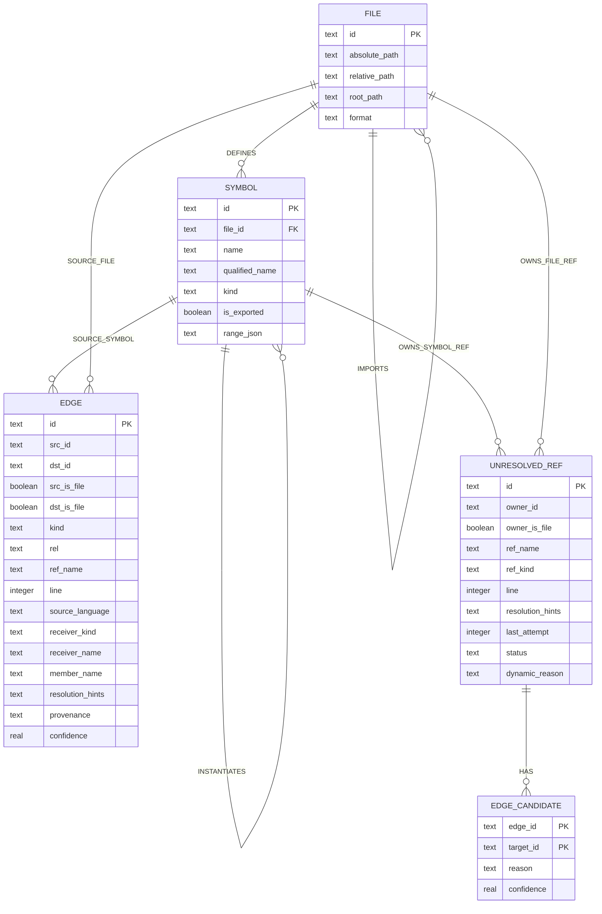

# Graph：当前能力、数据模型与查询链路

[Documentation](./README.md) · [Architecture](./05-architecture.md) ·
[Graph](./09-graph.md)

本文记录当前代码图模块的实际实现状态。它描述的是现有代码，而不是目标设计。

## 1. 定位与边界

代码图是主检索索引旁边的一层结构化关系索引：

- 主索引（Zvec）保存文件、代码实体、文本内容、FTS 与向量数据。
- 图索引保存文件、符号以及符号之间的结构和依赖关系。
- 图中的符号 ID 与主索引实体 ID 对齐；查询结果通过 ID 回到主索引补齐源码、路径和元数据。
- 默认持久化后端是 SQLite；邻接关系通过索引 SQL 批量读取，遍历控制和局部 RWR 在应用层执行。
- 图不可用时返回 `UnavailableGraphStorage`，普通搜索仍可使用 FTS/vector，只是没有图扩展。

图索引位于：

```text
<collection>/code-graph/graph.sqlite
```

`manifest.json`、`files.zvec`、`index.zvec` 和 `code-graph/graph.sqlite` 的路径统一由
`WorkspaceIndexLayout` 生成；创建、打开和 drop/rebuild 不再各自拼接 artifact 路径。

支持的 backend 为 `sqlite`、`off`，默认是 `sqlite`。可以通过
`ZVEC_GREP_GRAPH_BACKEND` 选择。

## 2. 当前能力

### 2.1 建图

对代码文件建立以下节点和关系：

| 类型 | 含义 | 典型来源 |
| --- | --- | --- |
| `File` | 已索引文件 | 文件扫描与主索引 |
| `Symbol` | 函数、方法、类、接口、Vue/Svelte 组件等公开代码实体 | `EntityFragment` |
| `DEFINES` | 文件定义符号 | 由 `Symbol.file_id` 隐式表达 |
| `CONTAINS` | 类/容器包含成员 | fragment 的父子关系 |
| `CALLS` | 调用、构造调用 | call-site 提取 |
| `REFS` | 类型引用、返回类型、成员引用等 | ref-site 提取 |
| `INHERITS` | `extends`、`implements`、`overrides` | inheritance-site 提取 |
| `IMPORTS` | 文件导入另一个文件 | import/include 提取和路径解析 |

同文件内能够唯一确定的引用会直接生成关系边；无法在本文件唯一确定的引用先进入
`unresolved_refs`，等所有文件写入后统一解析。同一 owner、名称、关系类型和行号下的多个引用会用
采集顺序中的 occurrence 区分 Ref ID，因此 `target(); target();` 不会在解析前被误去重。解析成功后，
该 occurrence 会迁移到 `edges`，并从 `unresolved_refs` 删除。

Vue/Svelte 单文件组件会建立独立的 `component` Symbol，脚本块中的实体通过 `CONTAINS` 归属该组件；
组件 import 支持 `.vue`/`.svelte` 扩展解析，Vue/Svelte 模板中的组件标签生成 `REFS`，Svelte 模板
表达式中的直接函数调用生成 `CALLS`。Explore 还会把组件根节点与脚本中精确解析的 named import
连接起来，使 store、composable 和 helper 能参与文件排序；该桥接不会展开 imported 文件中的全部符号。
HTML 原生标签、框架内建组件和 Svelte runes 不进入关系图。

### 2.2 引用解析

`resolvePending()` 已实现以下流程：

- `call`、`new` 解析为 `CALLS`。
- `extends`、`implements`、`overrides` 解析为 `INHERITS`。
- 其他符号引用解析为 `REFS`。
- 文件级 import/include 解析为 `IMPORTS`。
- 明确的语言内置符号或外部包引用被识别为 `external` 并丢弃。
- 无法解析的引用标记为 `failed`，后续索引完成时可以重试。
- 同名候选的选择顺序是：当前文件唯一候选、已导入文件中的唯一候选、全局唯一候选。
- 仍有多个候选时保持失败状态，不猜测目标。

### 2.3 图查询

`GraphReader` 当前提供：

- `callers` / `callees`：调用者和被调用者（包含构造关系），多层 BFS。
- `impact`：沿入向调用、引用、继承与实例化关系查找潜在受影响符号；类型容器会在同一层
  展开成员，以覆盖成员调用方。
- `usages`：查询一个符号的直接使用点。
- `hierarchy`：基类和派生类查询。
- `members`：容器成员查询。
- `pathBetween`：两个符号之间的调用路径。
- `context`：容器、成员、入边和出边的组合上下文。
- `outgoingEdges` / `incomingEdges`：按一批起点或终点 ID、边类型和数量上限，直接读取完整邻接边；
  `traverse`、`impact`、`hierarchy` 等遍历实际复用这层能力。
- `traverse`：按边类型、方向和深度进行通用遍历。
- `edges`：按节点集合和边类型直接返回真实边及其 `rel`、`count`、`first_line`、`ref_name`，
  但只保留起点和终点都在给定集合内的诱导子图边。Explore 用它恢复选定子图内部的真实关系。
- `deadCode`：基于图入边的启发式死代码候选。
- `stats`：文件、符号、待解析引用和各类边的计数。

### 2.4 对外入口

- CLI：`zg callers`、`zg callees`、`zg impact`、`zg explore`。
- MCP：`zvec_grep_callers`、`zvec_grep_callees`、`zvec_grep_impact`、
  `zvec_grep_explore`。
- CLI 和 MCP 只解析参数和格式化结果。实际调用统一进入 `ZvecGrep` service；Server 模式再经过
  `ZvecGrepDaemonBackend` 和 workspace read session，因此会复用 daemon 路由、workspace 锁及 session cache。
- daemon 为图操作维护独立的 model-free read session cache；Explore 和 neighborhood 只打开 SQLite。
  `files` 和 `symbols.range_json` 提供轻量展示投影，源码按 range 从当前工作区读取，因此图查询既不打开
  Zvec collection，也不获取、下载或验证 embedding model。
- 同一个 direct `ZvecGrep` service 的普通 Query 也按 manifest、embedding runtime 和模型配置复用只读
  `WorkspaceIndex`。index、refresh、drop 和 service close 会先等待活动 reader 并关闭旧 generation；
  endpoint/API key 或 manifest generation 变化不会复用旧句柄。
- 普通 `zg query` / `zvec_grep_search`：不会调用 `explore`，但会使用图做轻量候选扩展。

## 3. 数据模型

### 3.1 逻辑模型



引用 occurrence 在两个互斥状态之间迁移：

- `unresolved_refs` 保存尚未成功投影的源码事实，状态为 `pending`、`failed`、`external` 或 `dynamic`。
- `edges` 保存已经解析成功的关系，同时携带原引用的语言、receiver、member、binding、hint、来源和置信度。
- 解析成功时插入 `edges` 并删除对应的 `unresolved_refs`；目标或类型关系变化时，writer 可用边上的来源信息把它恢复成 unresolved ref，再重新解析。

其中：

- `owner_id` 表示这条引用由谁产生，也就是未来关系边的起点。
- `owner_is_file = false` 时，`owner_id` 是 `symbols.id`。例如 `login()` 中调用了尚未解析的
  `validateToken()`；解析成功后生成 `login --CALLS--> validateToken`。
- `owner_is_file = true` 时，`owner_id` 是 `files.id`，主要用于 import/include。例如当前文件导入
  `./token`；路径解析成功后生成 `当前文件 --IMPORTS--> token.ts`。

因此 `owner_id` 是多态引用：它的目标表由 `owner_is_file` 决定。SQLite 外键只能固定指向一张表，
当前 schema 无法同时声明 `owner_id REFERENCES symbols(id)` 和
`owner_id REFERENCES files(id)`，这部分完整性由写入与解析代码保证。

### 3.2 SQLite schema

| 表 | 主键 | 作用 |
| --- | --- | --- |
| `graph_meta` | `key` | 保存 `schema_version` |
| `files` | `id` | 图中存在的文件及 graph-only 展示所需的路径、格式和基础属性 |
| `symbols` | `id` | 符号及其所属文件、名称、限定名称、种类、导出状态和源码 range |
| `contains` | `(parent_id, child_id)` | 容器与成员关系 |
| `edges` | `id` | 已解析的 `CALLS`、`REFS`、`INHERITS`、`IMPORTS`、`INSTANTIATES` occurrence |
| `unresolved_refs` | `id` | 尚未解析、外部或动态的源码引用 occurrence |
| `edge_candidates` | `(edge_id, target_id)` | 动态 occurrence 的候选目标、依据和置信度 |

几点说明：

- `DEFINES` 没有单独建表，由 `symbols.file_id` 推导。
- `edges.kind` 表示大类，`rel` 保存更细的语义，例如 `call`、`new`、
  `extends`、`type`、`member`。
- `edges` 对调用、引用和继承关系按源码 occurrence 保存；查询时再按 `src / dst / kind / rel`
  聚合 `count`。`first_line` 保存首次出现行号，`ref_name` 保存提取时名称。
- `stats` 中的关系数量按 `SUM(count)` 统计，表示源码 occurrence 数，而不是物理 edge 行数。
  未解析统计分别提供 `pendingRefCount`、`failedRefCount`、`dynamicBoundaryCount` 和
  `externalRefCount`；兼容字段 `refCount` 等于 pending 与 failed 的合计。
- `edges.provenance` 区分 `static` 和 `heuristic`；`confidence` 保存关系置信度，`evidence`
  只保存无法由端点推导的解析依据，例如 `preferred_file`、`workspace_unique` 和
  `unique_member_in_visible_files`。同文件静态关系的 `evidence` 留空，可由 source/target 所属文件推导，
  避免为每条 occurrence 重复存储 `same_file`。静态边的默认置信度为 1。
- `unresolved_refs` 与 `edges` 都保留 receiver、member 和 resolution hints；成功解析不会丢失重新投影所需的信息。
  `resolution_hints` 以 JSON 保存语言分析器提供的 receiver type、泛型约束、候选类型和分派方式。
  `last_attempt` 用于控制失败引用的公平分批重试。
- `symbols.signature`、`arity` 和 `return_type` 保存用于重载过滤与类型传播的签名事实。`arity`
  直接从各语言的参数 AST 提取，不再按 signature 文本中的逗号推导；Rust 的 `self` 参数和 Python
  的首个 `self` / `cls` 参数不计入调用 arity，泛型类型内部的逗号也不会被误算为参数分隔符。
- `symbols.qualified_name` 保存语言级稳定身份，例如 `Namespace::Type::member`。receiver/member
  解析优先按限定名称匹配，再沿现有 `INHERITS` provider closure 查找；这使 C++ 头文件中的类型和另一文件中的
  out-of-line 方法定义可以关联，同时避免把其他容器中的同名方法当成候选。
- 查询层把 `parent.qualified_name + "::" + child.name == child.qualified_name` 视为派生 `CONTAINS`；
  它不额外写入物理边，但 `members`、遍历和 Explore 都能由头文件类型扩展到其他源文件中的方法定义。
- `unresolved_refs.status` 只包含 `pending / failed / external / dynamic`；不存在 `resolved` 状态。
  多目标调用保持 `dynamic` 并写入 `edge_candidates`。
  `resolvePending()` 不会全量 replay receiver facts；writer 根据 changed member/type/ref names、
  `INHERITS`、`INSTANTIATES`、当前 target 和动态候选计算受影响 occurrence，只撤销并重投影这部分引用。
- 目标文件删除或重建时，writer 通过 `edges.dst_id`、名称和 hints 定位受影响 occurrence，把边恢复为
  `unresolved_refs` 的 `pending` 记录。新增同名 symbol 也会使可能受影响的已解析引用重新投影。
- schema 使用 `STRICT`、外键、组合主键和按 src/dst/name 建立的查询索引。
- 当前 schema 版本为 4，增加 graph-only 查询使用的文件定位、symbol range 和紧凑展示元数据。它不复制源码、FTS 或向量；
  不兼容分支中间提交生成的实验数据库；
  read-only 模式遇到旧版本会明确拒绝打开，可写索引要求 rebuild。
- 引入图索引后，workspace `CURRENT_INDEX_VERSION` 已提升为 2。旧 v1 workspace 不会把 unchanged
  文件直接沿用为“已有图数据”，而是要求执行 rebuild；rebuild 会同时重建 Zvec 主索引和完整图索引。
- drop/rebuild 会删除 `<workspace>/.zvec-grep/code-graph`，不会把旧 `graph.sqlite`、节点或边带入新索引。

### 3.3 Ref ID

待解析引用的 ID 为：

```text
<owner>#sha1(ref_name, ref_kind, line, occurrence)[0:16]
```

它用于 unresolved ref 与解析后 edge 的稳定 ID、去重以及文件重建时的恢复，不参与符号目标解析。

## 4. 索引与持久化链路

索引和持久化按照下面五个阶段执行：

1. **一次解析生成统一 IR。** 扫描到代码文件后，`CodeExtractor.analyzeForIndexing()` 在同一棵
   Tree-sitter AST 上生成 fragments、imports、calls、refs 和 inheritance sites。AST 只在回调期间
   存活，后续主索引和图链路消费不含 AST handle 的 `PreparedCodeAnalysis`。

2. **分别消费统一 IR。** fragments 写入主索引，用于 FTS、向量检索和源码返回；
   `extractFileGraph()` 消费同一份 fragments 和 relation sites，生成 `Symbol`、`CONTAINS` 及引用数据，
   不再为 imports、inheritance、refs 和 calls 分别重新解析源码。此时只做文件内能够确定的解析，
   不查询其他文件。

3. **区分直接边和待解析引用。** 如果一个 site 在当前文件中能够唯一匹配目标，立即生成
   `CALLS`、`REFS` 或 `INHERITS` 边；否则生成带 occurrence 的 Ref，以 pending 状态写入 `unresolved_refs`。
   import 也先作为文件级 pending Ref 保存，等待完整文件列表可用后解析路径。

4. **写入并统一解析。** `upsertFileGraph()` 在 SQLite 事务中写入当前文件的 Symbol、直接边和
   pending Ref。所有文件处理完成后执行 `resolvePending()`。解析器按依赖顺序完整 drain 三个阶段：
   先解析 import，再分批建立完整的 `INHERITS` 关系，最后解析普通 `CALLS` / `REFS`；继承阶段
   完成后才创建 hierarchy cache，避免调用解析读到或缓存不完整的继承图。成功的引用转换成
   `CALLS`、`REFS`、`INHERITS` 或 `IMPORTS`，并删除相应 unresolved row；无法唯一解析的引用
   保留为 `failed`，等待后续索引重新尝试。

5. **提交增量数据。** `upsertFileGraph()` 和 `resolvePending()` 已经在 SQLite 事务中直接修改当前
   文件涉及的节点、边和引用。`checkpoint()` 只执行 WAL checkpoint，不再清空并重写整张图。

增量更新时，`upsertFileGraph(fileId, ...)` 会先替换该文件原有的节点和出边；删除文件时
`deleteFileGraph(fileId)` 删除其内容。受更新影响、原本指向被替换符号的入边会重新变成
pending occurrence，以便再次解析。import binding 的 `local_name`、`imported_name` 和目标文件直接保存在
未解析的 import ref 或已解析的 `IMPORTS` edge 中，不再维护独立 binding 表。删除目标文件时，这些 occurrence 会随普通
入向 import 一起失效并重新解析；
目标文件重试成功后，即使 import 方没有变化，也能恢复文件关系和 alias 调用边。

当前 SQLite backend 的具体工作方式是：

1. 打开 SQLite 时只建立连接并检查 schema，不加载完整节点和边。
2. `callers`、`callees`、`usages`、`edges` 等直接使用 source、target、kind 等索引查询。
3. `traverse`、`impact`、`hierarchy` 等在应用层维护 BFS frontier；每一层通过 `json_each()` 批量
   查询该层节点的邻接边，将剩余节点预算作为稳定排序后的 SQL `LIMIT` 下推，再批量读取目标节点类型，
   避免逐节点 N+1 查询和高扇入/扇出节点的无界物化。
   `expandSeeds()` 和 `expandFileNeighbors()` 的 limit 则按输入 seed 独立执行，避免高扇出 seed
   占满其他 seed 的结果窗口。混合关系遍历先给每种 edge kind 分配基础配额，再把空类型的剩余预算
   轮转补给仍有结果的类型，避免 `CALLS` 长期挤掉 `IMPORTS` 或 `INSTANTIATES`。
4. Explore 只把预算内局部子图放进内存并运行 RWR，内存占用与查询子图规模相关，而不是与完整
   仓库图规模相关。
5. `upsertFileGraph()` 按文件事务增量替换数据，`checkpoint()` 只推进 WAL；WAL 和
   `synchronous=NORMAL` 继续负责并发读取与同步策略。

SQLite persistence 已按职责拆分：`reader.ts` 负责索引查询和遍历，`writer.ts` 负责文件级事务写入，
`pending-ref-resolver.ts` 负责跨文件引用及 import binding 解析；`schema.ts` 和 `runtime.ts` 分别管理
DDL 与 Node SQLite 加载。`sqlite.ts` 只保留组合这些单元的 `GraphStorage` facade，RWR 排序算法位于
`graph/application/ranking.ts`。

因此当前只有一套真实图存储实现：“SQLite 索引查询 + 应用层局部遍历”。测试使用 SQLite 的
`:memory:` 模式，不再维护另一套 Map/Set 图存储逻辑。Explore/RWR 仍会为单次查询构建有预算限制的
临时邻接表，但它不是持久化 backend，也不包含完整仓库图。

## 5. 查询链路

当前有三条不同的查询路径，不应混为一条。

### 5.1 普通 query/search

query 严格按照下面四个阶段执行：

1. **初始搜索。** 使用用户输入的 query 分别执行 FTS 和 vector 搜索，再做第一次 RRF，得到一份
   按相关性排序的初始代码候选。

2. **图补召回。** 取初始列表中排名最高的 5 个候选作为图种子，查找调用、引用、继承、容器关系
   和相邻 import 文件。RWR 对找到的符号排序，形成一份额外的图相关代码候选。

3. **最终排序。** 把初始候选和图相关候选放在一起做第二次 RRF，然后按照 query limit 截断，
   得到最终的 `SearchHit[]`。

4. **组装输出。** 返回最终代码结果，同时从内部关系子图中挑选与这些结果有关的少量关系，形成
   `relationships` 摘要。

换成一个具体例子：

```text
用户搜索：login authentication

阶段 1 找到：
  login、AuthService、loginController

阶段 2 根据代码关系额外找到：
  validateToken、LoginRequest

阶段 3 统一排序后得到：
  login、AuthService、validateToken、loginController、LoginRequest

阶段 4 返回上述代码，并补充关系说明：
  loginController --CALLS--> login
  login --CALLS--> validateToken
  login --REFS--> LoginRequest
```

图的边参与扩展、RWR 排序和关系摘要生成；最终主体仍是 `SearchHit` 代码列表，不会把完整的
80 节点局部子图直接返回。

普通 query 的图扩展是浅层辅助召回：

- 最多取初次融合后的前 5 个种子。
- 调用与完整 explore 共用的 `exploreSubgraph()`，使用深度 2、最多 80 个节点的小预算。
- seed 的 restart 权重来自首轮 RRF rank，排名靠前的 seed 权重更高。
- 子图覆盖层级以及 `CALLS`、`REFS`、`INHERITS`、`CONTAINS`，并通过带权 RWR 对节点排序。
- RWR 当前边权为 `CALLS=1.0`、`INHERITS=0.9`、`CONTAINS=0.7`、`REFS=0.5`；
  排名图仍按双向关系传播。
- 文件级 `IMPORTS` 不属于符号子图，仍作为补充路径从相邻文件挑选少量实体。
- 图 rank 会作为 graph recall evidence 合并到已有候选，也会创建新的图候选，再以惩罚后的
  synthetic rank 进入第二次融合。
- seed 只有实际参与至少一条保留关系边时才会获得 graph recall evidence；没有任何图关系的
  初始候选不会因为图后端处于可用状态而被重复加分。
- 新增与已有图候选都会重新应用普通 query 的 file/path/type 等 storage filter，图扩展不会绕过
  用户给定的检索范围。
- 它不会调用完整的 `exploreGraph()`，不会组装源码 context pack，也不会计算调用路径和
  blast radius；它复用的是拆分后的子图扩展与 RWR 节点评分层。

普通 query 的主体输出仍是代码 `SearchHit`，但会附带一个紧凑的 `relationships` 摘要，帮助调用方
理解这些结果为什么在图上相关：

- 只保留至少一端属于最终结果或 seed 的关系；另一端可以不占用正文 hit 配额，因此小 `limit` 仍能
  说明调用、继承和容器结构。
- 两个关系端点都必须通过原 query filter，不会借关系泄露被排除实体。
- 支持 `CALLS`、`INHERITS`、`CONTAINS`、`REFS` 和文件级 `IMPORTS`。
- 按上述关系类型优先级排序、去重，全局最多输出 20 条。
- CLI/MCP 紧凑文本在源码结果后输出，例如
  `login (function, src/auth/login.ts) --CALLS--> validateToken (function, src/auth/token.ts)`；structured
  result 同时提供端点 ID、label、kind、scope、文件、符号类型、`rel/count` 和
  `provenance/confidence/evidence`。

普通 query 不返回完整局部子图，而是输出经过图增强的扁平代码结果，并在末尾追加关系摘要：

```text
src/auth/login.ts:20-38
matchedBy: fts
source:
export async function login(...) { ... }

src/auth/token.ts:45-61
matchedBy: graph
source:
export function validateToken(...) { ... }

relationships:
- loginController --CALLS--> login
- login --CALLS--> validateToken
```

其中源码项来自 `SearchHit[]`；`relationships` 只解释最终结果附近的关键关系，最多 20 条。


### 5.2 callers / callees / impact

这三个命令都先按实体 ID 或精确符号名确定一个 seed，然后从这个 seed 做定向遍历：

- `callers` 沿入向 `CALLS + INSTANTIATES` 查找谁调用或构造了 seed。
- `callees` 沿出向 `CALLS + INSTANTIATES` 查找 seed 调用或构造了谁。
- `impact` 沿入向 `CALLS + REFS + INHERITS + INSTANTIATES` 查找修改 seed 后可能需要检查的
  依赖符号；seed 是类型容器时还会通过其成员继续查找外部依赖。

图只负责返回符号 ID；输出前会回到主索引补齐符号名、类型和文件路径。正常结果例如：

```text
callers: validateToken (src/auth/token.ts)
root: /workspace
depth=2 limit=20
- login (src/auth/login.ts) function
- refreshSession (src/auth/session.ts) function
- requestHandler (src/http/handler.ts) function
```

`callees` 和 `impact` 使用相同结构，只是首行方向和邻居含义不同：

```text
callees: login (src/auth/login.ts)
depth=1 limit=20
- validateToken (src/auth/token.ts) function
- loadUser (src/user/repository.ts) function

impact: LoginRequest (src/auth/types.ts)
depth=2 limit=20
- login (src/auth/login.ts) function
- loginController (src/http/login-controller.ts) function
```

同一个名称匹配多个独立定义时，不会猜测目标或合并其邻居，而是按语义定义分组、分别遍历：

```text
callers: parse
definitions=2 depth=1 limit=20 per definition

definition: parse (src/json/parser.ts)
results=1
- decodeJson (src/json/decode.ts) function

definition: parse (src/config/parser.ts)
results=1
- loadConfig (src/config/load.ts) function

narrow with --file <relative-path> or --seed-id <id>
```

`--file`（MCP 中为 `file`）可按相对或绝对源码路径收窄同名定义；`seedId` 仍可精确选择单个
实体。头文件声明与对应实现会组成一个语义组并共同遍历，但不同文件中的多个真实定义不会仅因
`symbolType + scope + name` 相同而被错误合并。文件过滤没有匹配时会给出 warning 并回退到
全部定义组，而不是把“过滤路径错误”伪装成“符号不存在”。

其他边界输出为：

```text
no seeds for query: missingSymbol
```

```text
callers: standalone (src/util.ts)
depth=1 limit=20
(no neighbors)
```

图存储无法打开或被关闭时返回 `graph unavailable`。

结构化结果包含查询方向、seed 候选、最终 seed 和邻居：

```ts
type GraphNeighborhoodResult = {
  available: boolean;
  direction: "callers" | "callees" | "impact";
  query: string;
  depth: number;
  limit: number;
  seeds: GraphSeedMatch[];
  ambiguous?: boolean;
  groups?: {
    seed: GraphSeedMatch;
    members: GraphSeedMatch[];
    truncated?: boolean;
    neighbors: EnrichedSymRef[];
  }[];
  groupsTruncated?: boolean;
  seed?: GraphSeedMatch;
  neighbors: EnrichedSymRef[];
};
```

该路径面向语义定义组的定向邻域查询；`callers` / `callees` 默认深度 1，`impact` 默认深度 2，
默认每组限制 20。深度限制为 1–10，结果限制为 1–200；同名定义组最多输出 8 组，避免
monorepo 中常见名称导致无界查询。

### 5.3 explore

Explore 按下面的顺序执行：

1. **选择入口。** 根据 `seedId`、精确符号名或自然语言文本检索选择 roots，默认最多保留 8 个。

2. **建立候选子图。** 先扩展基类、派生类和 sibling types，再沿 `CALLS`、`REFS`、
   `INHERITS`、`CONTAINS` 双向遍历。随后补充 roots 的直接 callers、callees 和父容器、兄弟成员。

3. **补全调用路径。** 在多个 roots 之间寻找可证明的调用路径。路径节点会被优先保留；节点预算
   仍不足以容纳完整路径时，该路径不会进入输出，保证 `callPaths`、`nodes` 和 `edges` 自洽。

4. **分析修改影响。** 从 callable roots 的参数和返回类型收集 change surface；同时反向查找
   dependents 和测试，形成 blast radius。

5. **计算文件相关性。** 在裁剪后的局部子图上运行 RWR，将节点分数按文件聚合。文本命中弱、
   图分低但属于接口签名的类型文件，可以由 change surface 救回。

6. **组装上下文。** 按文件分数和保留优先级选择文件，从主索引取出相关符号源码，在文件数和字符
   预算内组成最终的多文件 context pack。

Explore 使用重启概率 `alpha = 0.25`、25 次迭代的 personalized random walk。
因此可以视为 PPR/RWR 风格排序，但它排序的是选中子图聚合后的文件，不是一个独立数据库的
全图 PPR 服务。默认预算为深度 3、最多 200 个节点、8 个文件、24,000 字符。

Change surface 是独立于 blast radius 的接口影响提示：

- 只检查前 5 个可信 callable roots。
- 从直接出向 `REFS` 中收集 `type` 和 `return`，并只保留 class/interface/type 等类型实体。
- 所有候选会进入 `ExploreResult.changeSurface`，区分参数类型和返回类型。
- 如果候选文件没有 query term 命中，并且 RWR 图分很弱或会被 `maxFiles` 截掉，则标记为
  `rescued`。
- root 文件优先级最高；rescued change-surface 文件随后获得文件预算保留资格，并在输出中标为
  `change-surface`。
- 当前提取器把函数、方法和构造器统一建模为 `function`，因此它们使用相同的收集路径。

Explore 输出的是可直接交给人或 Agent 阅读的多文件上下文包，不是单纯的邻接节点列表。文本结构为：

```text
explore: how does login reach validateToken
root: /workspace
roots: login, validateToken
subgraph: 24 nodes, 31 edges, 5 files

call paths:
- login -> authenticate -> validateToken

blast radius:
- login:
  dependents: loginController, requestHandler
  tests: loginTest

change surface:
- login type -> LoginRequest
- login return -> LoginResult (rescued)

dynamic boundaries:
- dispatch -> handler.handle (unknown_receiver_type)

relationships:
CALLS:
- login --CALLS--> authenticate
REFS:
- login --REFS--> LoginRequest

src/auth/login.ts (central, score=0.3512)
selected: login(root), authenticate(calls)
source:
// function login L20-38
20  export async function login(...) { ... }

src/auth/types.ts (change-surface, score=0.0021)
selected: LoginResult(references)
source:
// class LoginResult L1-12
1  export class LoginResult { ... }
```

各部分含义如下：

| 输出部分 | 含义 |
| --- | --- |
| `roots` | 名称、自然语言检索或 `seedId` 选出的入口符号 |
| `subgraph` | 预算内保留的节点数、边数和最终文件数 |
| `call paths` | 多个 root 之间能够证明的调用路径 |
| `blast radius` | root 的反向依赖和测试文件提示 |
| `change surface` | callable 的参数/返回类型；`rescued` 表示原本会被文件预算埋没 |
| `relationships` | 全局关系摘要，按 `CALLS / INHERITS / REFS / INSTANTIATES` 分组并分别限额；不重复输出 `CONTAINS` |
| `selected` | 文件入选原因，例如 root、跨文件 definition、calls 或 references |
| `source` | 根据 SQLite 中的文件定位和 symbol range，从当前工作区源码按需组装 |

文件标签含义：

- `central`：RWR 聚合分位于中央层的文件。
- `change-surface`：因接口签名类型被救回的文件。
- `related`：其他进入文件预算的图相关文件。

Explore 的结构化结果为：

```ts
type ExploreResult = {
  available: boolean;
  query: string;
  roots: ExploreNode[];
  nodes: ExploreNode[];
  edges: ExploreEdge[];
  edgesTruncated: boolean;
  callPaths: ExploreCallPath[];
  blastRadius: ExploreBlastRadius[];
  changeSurface: ExploreChangeSurfaceRef[];
  dynamicBoundaries: DynamicBoundary[];
  dynamicBoundariesTruncated: boolean;
  files: ExploreFileBundle[];
  emptyReason?: "graph_unavailable" | "no_seeds" | "no_context";
};

type ExploreEdge = {
  src: string;
  dst: string;
  kind: GraphEdgeKind;
  rel: string;
  count: number;
  firstLine: number;
  refName: string;
  provenance: "static" | "heuristic";
  confidence: number;
  evidence?: string;
};
```

`edges` 是存储层返回的真实类型化边，不是根据邻接节点猜测的关系；同一对节点可以同时出现
`CALLS` 和 `REFS`，并保留关系子类型、聚合次数、首次行号和提取时名称。静态绑定的边标记为
`provenance: "static"`；静态解析失败、但可见文件中只有一个同名成员候选时，允许生成
`provenance: "heuristic"` 的低置信度边。RWR 会按 `confidence` 降权，文本关系摘要也会显示该边是推测。

`dynamicBoundaries` 不是另一种边。它记录子图节点仍未确定的 receiver 调用，例如动态对象、接口分派或
无法确定接收者类型的 `obj.method()`，让 Agent 知道静态图在这里断开，而不是把“没有边”误读成
"没有调用"。每个 boundary 同时返回预算内的 `candidates`；单条 boundary 的
`candidatesTruncated` 和结果级 `dynamicBoundariesTruncated` 会明确指出候选或边界列表是否被预算截断。
只有 `call` 引用会进入 dynamic boundary；字段/member 引用不会混入。Explore 默认只展示带实际候选的
多态边界；没有候选的 `unknown_receiver_type` 仍保留在图查询中，但不进入默认 context pack，避免容器方法
和第三方 API 调用淹没输出。resolver 会按源语言识别内建 receiver；在没有真实图候选时，
TypeScript 的 `Array / Map / Set / Promise`、Python 的 `list / dict`、Java 集合、Rust 标准容器以及 C++ STL
容器等会被标记为 `external`，不会写成 dynamic boundary。真实存在的同名用户类型仍优先参与解析。

结构化 target 的 `receiverType`、`candidateTypes`、`genericBounds` 和 `dispatch` 由语言 AST 提取：
Go 支持方法 receiver、参数类型和类型参数 constraint；Rust 支持参数类型和 trait bound；Java 支持参数
类型；C++ 支持参数类型和 constrained template 参数。resolver 先按 receiver type 查找容器，再沿
`INHERITS` 的 extends/implements/trait 方向收集实现成员。只有 Go interface 在没有显式继承边时，
会按语言的结构化 typing 规则在可见文件内使用 method set 候选；Java interface 和 Rust trait 必须来自
显式 `implements` / trait impl 关系，不能用无关类的同名方法补候选。唯一候选可以生成带 provenance/confidence 的关系；
多个候选保留为 `polymorphic_dispatch` boundary，不会伪造唯一调用边。
若 receiver type 在可见图中不存在，即使工作区里只有一个同名方法，也保留为
`unknown_receiver_type` boundary，不会退化成跨类型的全局同名连接。继承方法按 provider 深度选择最近的
具体实现；抽象类中的具体方法仍可由已实例化子类继承，真正的抽象方法则不会成为 `CALLS` 目标。
Go method set 校验会沿嵌入 interface/type 的 `INHERITS` provider closure 递归展开，因此 promoted method
也可用于判断一个具体类型是否完整实现 interface。

候选选择同时使用方法 `arity` 过滤重载。字段、局部变量显式类型以及简单的 `new Type()` 赋值会补充
receiver type；`INSTANTIATES` 记录实际构造过的类型。当 CHA 得到多个实现且其中只有部分类型被实例化时，
RTA 优先保留这些实际类型；仓库没有实例化证据时仍保留完整 CHA 候选，避免把未覆盖测试路径误删。
RTA 会把已实例化子类继承的方法映射到实际 provider，例如实例化 `Child extends Base` 时，
`Base.run` 仍作为 `Child` 的活跃实现参与候选。`abstract class` 以 `abstract_class` symbol kind 保留，
其抽象方法不会被投影成确定的 `CALLS`。

增量更新实现类型或 `INHERITS` 关系时，resolver 会同时失效已有候选和空候选 dynamic boundary；
因此“最初没有实现、后来新增实现”的调用也会重新投影，不依赖 `edge_candidates` 中预先存在记录。

resolver projection 与 reader 的 dynamic-boundary 查询共用 `SemanticCandidateRepository`，不再维护两份
递归候选 SQL。repository 统一处理可见文件、arity、RTA、排序和预算；Java、Go、Rust 策略分别决定
`extends/implements/trait` 范围与 interface/trait method-set 的结构化候选规则。

Explore seed selection 对完整 symbol name 采用 exact-first：只要存在精确命中，就不再把语义召回结果混成
额外 roots；同名候选中生产文件优先于测试文件。源码组装始终把 root 所属文件标记为 central，并对非 root
测试文件降权；`third_party/vendor/node_modules`、examples/benchmarks 和 tools/scripts 也按程度降权，除非查询
明确提到对应目录。与 root 类型 qualified name 匹配的跨文件方法 definition 会获得额外文件分，优先于普通
邻居进入预算。若 class/type 的源码 range 已完整包含成员 range，只输出外层源码块，避免 class body 与方法
再次重复占用字符预算。源码片段按真实起始行编号，离散片段之间输出 `... (gap) ...`。

类型事实收集会在进入嵌套 method/function/constructor entity 前停止，节点边界按 type 和 source range
判断，不依赖 Tree-sitter wrapper 对象身份，因此匿名内部类或嵌套函数的参数不会污染外层 receiver map。
类型环境由语言 adapter 按源码顺序和 AST 位置预先生成 `CallResolutionFact`，`call-sites` 只负责收集调用
并合并对应位置的 fact。adapter 进入词法 block 时压入 scope，声明只影响其后的节点，离开 block 时弹出
scope；同名局部变量在兄弟 block 中不会互相覆盖，函数参数和容器字段位于外层环境。语言专属的参数、
声明和类型推导规则可以在 adapter 边界内演进，不再扩张通用调用收集器。
成员语法统一识别 `.`, `->` 和 `::`；例如 C++ / Rust 的 `Base::helper()` 会保留原始文本，同时形成
`receiver=Base`、`member=helper` 的结构化 target。

默认输出预算为最多 8 个 seeds、深度 3、200 个子图节点、8 个文件和 24,000 字符。
`maxChars` 是最终源码文本的硬上限，首个符号超过预算时也会截断；roots 和调用路径节点在子图裁剪时
优先保留，但无法完整保留的调用路径会被删除。

## 6. 已知问题与限制

### 6.1 解析精度

这是当前最主要的能力瓶颈。

- 基于名称和启发式作用域解析，不是 TypeScript language service 或编译器级解析。
- JS/TS named/default import alias 和 Python `from ... import ... as ...` 已通过 binding IR 解析；default
  import 会优先选择组件或目标文件中唯一导出的顶层实体。namespace、限定名和复杂 re-export 链仍不完整。
- 不理解 `tsconfig paths`、package exports、workspace package 等完整模块解析规则。
- 当前提取方法 receiver、函数参数、字段、局部变量显式类型、简单构造赋值和直接泛型约束；尚未进行
  分支合流、复杂赋值、容器元素、返回值跨函数传播；
  这些来源的 `obj.method()` 仍只能在唯一可见成员候选时建立低置信度 heuristic edge，否则作为
  dynamic boundary 输出。
- 重载、同名方法、嵌套作用域和跨文件多候选容易保持 `failed`。
- 动态语言调用、反射、运行时注册、依赖注入和字符串形式调用无法可靠建边。
- external/builtin 过滤是名称规则，存在误判或漏判可能。

### 6.2 Ref ID 的位置稳定性

Ref ID 已加入 occurrence，同一 owner、同一行上的两个同名同类引用不会再发生 ID 冲突。当前
occurrence 仍依赖提取遍历顺序，尚未使用 column 或稳定 source range；同一行引用顺序变化时，
对应 ID 可能变化。后续可改用 source offset/range 作为精确位置标识。

### 6.3 SQLite 持久化效率

- SQLite backend 已改为索引点查、分层批量 BFS 和按文件事务增量写入，不再打开时加载全图或在
  checkpoint 时全表重写。
- RWR 仍在查询期局部内存子图上运行；这是有界计算，但极高出度节点仍可能产生较大的单层查询。
- 主索引与图索引不是同一个事务；任一侧写入失败时仍需要明确的恢复/重建状态。
- read-only 打开失败会保留 unavailable reason 并进入 diagnostics；write mode 的意外打开失败会直接报错。
- 图 schema 作为相对 main 的首版实现，不兼容开发分支中间提交产生的实验数据库，也没有通用逐版本
  migration 框架。

### 6.4 数据一致性与模型约束

- `unresolved_refs.owner_id` 以及 `edges.src_id/dst_id` 是多态引用，SQLite 无法直接保证它们一定指向
  有效 File 或 Symbol；完整性由 writer 和 resolver 维护。
- `DEFINES` 只由 `symbols.file_id` 推导，接口层仍把它作为边类型，物理模型与逻辑模型不完全一致。
- 跨文件解析边按 occurrence 保存；同文件直接解析阶段仍可能把相同关系折叠到 `count`，因此不能保证
  所有关系都能逐位置枚举。
- Ref 的 `failed` 没有失败原因、候选列表和重试次数，排障信息不足。
- failed 引用使用分批 drain 和 attempt watermark 避免饿死与同轮重复，但失效集合仍是静态分析近似，
  不是编译器级依赖闭包。

### 6.5 查询与排序

- 普通 query 使用固定小预算的 explore 子图扩展，边权、预算和 synthetic rank penalty 尚不可配置
  或学习。
- 普通 query 会在尾部结果中为“与 seed 直接相连且来自新文件”的图命中保留有限位置；被提升的命中
  通过 `forced` 和 `matchedBy=graph` 暴露来源。它不会替换 seed 或唯一文件，也不会把任意多跳邻居
  强行塞进结果。Vue 组件引用 Pinia store 这类跨文件结构关系因此可以进入正文结果，而不只出现在
  relationship 摘要中。
- CLI 冷启动 query 的总耗时还包含 Node 进程、配置、embedding model acquire 和 query embedding；
  它不能直接当作 SQLite 图查询耗时。性能回归应同时记录 service 内部的 `query_embedding`、
  `recall`、`graph_expand` 和 `search_total`，并区分冷启动与常驻 daemon/session。真实 Go 查询中，
  复用 service 后的后续请求约为 22–25ms；CLI 冷启动仍约为 700–900ms，两者不能混用一个指标。
- Explore 的种子质量依赖主索引精确名称/文本检索；自然语言短语可能选到噪声种子。
- Explore 的声明/实现配对先按候选文件 stem 批量读取符号，再由统一 counterpart policy 校验路径；
  不再为每个头文件分别扫描整个 symbols 表。NeuG `NeugDB` 的相同 `8 files / 152 nodes`
  结果在本地热测中由约 366–373ms 降至 327–335ms。
- Change surface 依赖已经成功解析的直接 `type`/`return` 边；未解析 alias、泛型绑定或动态类型
  不会被救回。
- Explore 直接通过 SQLite source/target/kind 索引读取类型化边，同一对节点并存的 `CALLS`、
  `REFS` 等关系会分别保留。
- RWR 只在预算裁剪后的局部子图运行，结果受选种、遍历顺序和预算影响。
- `impact` 本质上是入向调用、引用、继承和实例化关系的启发式影响范围，不等价于编译依赖或
  测试覆盖分析。
- 大型动态语言项目中的 receiver、猴子补丁、反射、依赖注入和运行时注册无法由 Tree-sitter 静态事实
  完整证明。当前策略是：有可靠 binding/type/hierarchy 证据时生成关系；存在多个可信目标时保留
  dynamic boundary；缺乏证据时保持 unresolved/external，不退化为工作区全局同名方法连接。
- TypeScript 与 Python 的联合类型参数和局部变量会保留完整候选集合，例如 `Alpha | Beta` 不再被
  压缩为最后一个类型；成员调用投影为带候选的 `polymorphic_dispatch` boundary。单一类型注解仍走
  确定解析，词法重绑定会遮蔽旧候选。
- Python 会从 `__init__` 中带类型注解的参数赋值恢复实例字段类型，例如
  `self.driver = graph_driver` 会把 `GraphDriver` 传播到其他方法中的 `self.driver.execute_query()`；
  只接受构造器参数注解或字段自身注解，不从任意运行时赋值猜测类型。
- 链式 factory receiver 使用 owner-qualified callable identity，例如 `Alpha::new()` 与 `Beta::new()`
  不再共享一个由遍历顺序覆盖的裸 `new` 返回类型；只有同文件全部裸同名 callable 返回类型一致时才允许
  bare fallback。Java/TypeScript 的显式 `new Type()` 直接使用语法中的 nominal type。Go 的普通
  `Factory()` 不再被误当成类型，仅对惯用 `NewType() -> Type` 保留启发式恢复，真实返回签名存在时仍以
  签名为准。
- Go import 的可见性按 package 目录展开，而不是只使用 import path 解析出的一个代表文件。结构候选索引
  在内存中校验完整 interface method set、嵌入 interface/struct 的 promoted methods，并选择最近 provider。
  Chi 完整 rebuild 中，`Router` receiver 的 231 条 `unknown_receiver_type` 转为带候选的
  `polymorphic_dispatch`；graph resolve 从递归 SQL 版本约 1,122ms 降至约 236ms。
- 在固定 Graphiti worktree 完整 rebuild 后，Python `unknown_receiver_type` 从 1,956 降至 772；
  Python 构造赋值和带装饰器函数会在内部 callable AST 上建立逐调用点类型环境，FastAPI、pytest、
  Click 等框架常见的装饰器不会再导致整个函数的参数与局部绑定丢失。
  `Annotated[T, ...]` 等单目标类型包装会按当前 import closure 展开；不同模块复用同一 alias 名时
  不依赖数据库行顺序，循环 alias 在 16 层以内按 visited set 保守停止。
  同时生成 790 条带候选证据的 `polymorphic_dispatch`。其中 `QueryExecutor`/`GraphDriver` 是 ABC，
  因此保留候选边界而非伪造确定 CALLS。带默认参数、可选参数、rest/splat 的 callable 不再使用错误的
  固定 arity 过滤；当前 schema 还没有 min/max arity，因此这类 callable 以未知精确 arity 保存。
  该次 16,527 条 symbol refs 的 graph resolve 约 915ms。
- `deadCode` 是基于图入边的候选判断，不能证明代码不可达。

### 6.6 覆盖面与可观测性

- 现有测试覆盖本地/跨文件 CALLS、REFS、INHERITS、IMPORTS、SQLite 持久化、query 和 explore
  的主要 happy path，但复杂语言语义、超大图、崩溃恢复和并发读写覆盖不足。
- `GraphStats` 只有数量，没有解析成功率、failed 原因分布、构图耗时、checkpoint 大小等指标。
- Node.js 的 `node:sqlite` 在当前 Node 22 运行时仍可能输出 experimental warning。

## 7. 建议的后续优先级

1. **提升引用位置精度**：当前 occurrence 已避免同一行引用冲突；后续采集 column/source range，
   让引用身份不依赖遍历顺序，并为旧数据提供重建策略。
2. **提升解析正确率**：继续实现 namespace/default import、限定名和 re-export 链，再处理 tsconfig paths。
3. **增加解析诊断**：记录失败原因、候选目标和重试次数，暴露 resolved/failed/external 指标。
4. **强化一致性**：明确主索引成功、图写入失败时的恢复/重建状态，提供可见错误而非静默降级。
5. **优化高出度遍历**：为超大 frontier 增加分批上限和查询取消，避免单次 SQL 参数或结果集过大。
6. **建立质量基准**：增加 alias、重载、同名符号、monorepo、动态语言和大图性能测试集。

## 8. 当前结论

当前图模块已经形成可运行的闭环：代码提取、关系建模、跨文件 pending resolve、SQLite
持久化、普通搜索的浅图扩展，以及独立的 neighborhood/explore 查询都已接通。它适合辅助代码发现、
调用关系浏览和多文件上下文组装。

现阶段的主要风险不在“链路是否存在”，而在“语义解析精度”和“全量内存/全量快照”的扩展性。
在把它定位为启发式代码导航层时已经可用；如果要作为编译器级依赖分析或大规模精确关系图，
仍需要优先补齐引用绑定、一致性与可观测性。


#### 是否把 Explore 融入 query

当前采用的是“共享底层能力、保持两种输出”的部分融合，而不是让每次 query 都完整调用
`exploreGraph()`：query 复用 `exploreSubgraph()` 和 RWR 做轻量扩展，并返回紧凑关系摘要；只有显式
Explore 才继续计算调用路径、blast radius、change surface，并组装多文件 context pack。

如果把完整 Explore 直接融入每次 query，收益是一次请求就能同时获得相关代码、调用关系和修改影响，
Agent 不必先 query 再决定是否 explore；对“理解一条业务链路”或“修改这个接口会影响哪里”这类问题，
上下文也会更完整。但它会带来以下问题：

- 每次普通搜索都要执行更深的图遍历、路径搜索、影响分析和源码组装，延迟及 SQLite 查询量明显增加。
- query 的 `limit` 表示代码命中数量，Explore 的 `maxFiles`、`maxNodes`、`maxChars` 表示上下文预算；
  强行合并后，参数和截断语义会变得不清楚。
- query 当前是可稳定分页、过滤和排序的扁平 `SearchHit`；完整 Explore 是围绕 roots 组织的上下文包。
  合并会改变 CLI、MCP 和 API 的输出契约，也可能让低图分但被 change surface 救回的文件干扰普通
  相关性排序。
- 首轮检索选错 seed 时，完整 Explore 会围绕噪声 seed 扩展更多内容，比当前小预算扩展更容易放大误召回。

如果完全不融合，query 会更快、输出更稳定，但只能依据文本和向量找到“看起来相关”的代码，容易漏掉
名称不同的调用者、被调用者、接口类型和相邻实现；调用方还必须额外执行 Explore 才能拿到完整关系，
并自行处理两次请求之间的 seed 传递与消歧。

因此当前更合理的边界是保留部分融合：普通 query 用小预算子图改善召回，并输出足够解释结果的真实边；
Explore 保持为显式的深度理解接口。后续如果需要“一次请求返回完整上下文”，更适合增加明确的
`query` 模式或选项（例如 `graphMode: "off" | "rank" | "explore"`），而不是无条件让所有 query 执行
完整 Explore。这样默认延迟和返回结构保持稳定，调用方也能按任务主动支付更高的图分析成本。
